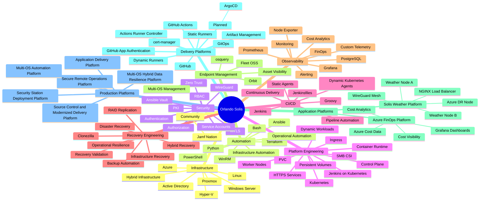
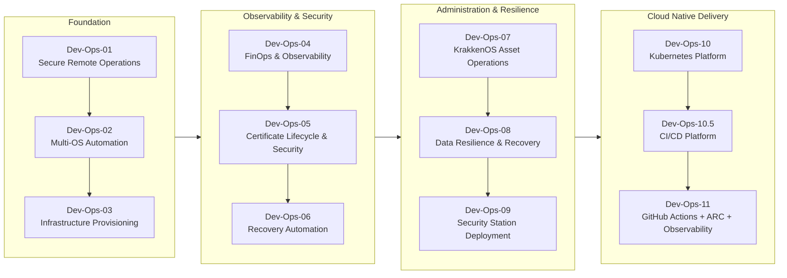

# Orlando Solis

### Platform Engineering | DevSecOps | Site Reliability Engineering

Self-taught platform and infrastructure engineer with about 20 years in IT, building secure hybrid infrastructure, Kubernetes-native CI/CD, and automation-first platforms across Windows, Linux, Azure, Proxmox, Active Directory, and Kubernetes, while documenting the journey through a public, verifiable portfolio.

---

## Technology Ecosystem

---

## Portfolio

| Status | Platform | Focus |
|---|---|---|
| Complete | [Dev-Ops-01 — Secure Remote Operations](https://github.com/luisorlandosolis/dev-ops-01-secure-remote-operations-platform) | Hardened remote access foundation for the lab |
| Complete | [Dev-Ops-02 — Multi-OS Automation](https://github.com/luisorlandosolis/dev-ops-02-multi-os-automation-platform) | Cross-platform configuration management (Windows/Linux) |
| Complete | [Dev-Ops-03 — Hybrid Infrastructure Provisioning](https://github.com/luisorlandosolis/dev-ops-03-hybrid-infrastructure-provisioning-platform) | Azure + Proxmox provisioning via Terraform and Ansible |
| Complete | [Dev-Ops-04 — FinOps & Cost Observability](https://github.com/luisorlandosolis/dev-ops-04-finops-cost-observability-platform) | Azure cost ingestion and observability pipeline |
| Complete | [Dev-Ops-05 — Certificate Lifecycle & Security Response](https://github.com/luisorlandosolis/dev-ops-05-certificate-lifecycle-security-response-platform) | Automated certificate remediation and closed-loop security response |
| Complete | [Dev-Ops-06 — High Availability & Recovery Automation](https://github.com/luisorlandosolis/dev-ops-06-hybrid-infrastructure-recovery-automation-platform) | Post-outage recovery automation across the lab |
| In Progress | Dev-Ops-07 — KrakkenOS Universal Asset Operations Platform | Universal software distribution, asset lifecycle management, governance, compliance, and automation platform |
| Complete | [Dev-Ops-08 — Multi-OS Hybrid Data Resilience & Preventive Disaster Recovery](https://github.com/luisorlandosolis/dev-ops-08-multi-os-hybrid-data-resilience-preventive-disaster-recovery-platform) | Cross-environment backup and recovery |
| Complete | [Dev-Ops-09 — Security Station Deployment & Recovery Platform](https://github.com/luisorlandosolis/dev-ops-09-security-station-deployment-operations-platform) | Security Station virtualization, deployment automation, recovery workflows, camera integration, WinRM/RDP automation, and operational standardization |
| Complete | [Dev-Ops-10 — Kubernetes Platform Engineering & Operations Platform](https://github.com/luisorlandosolis/dev-ops-10-kubernetes-platform-engineering-operations-platform) | Kubernetes platform engineering, operations, and workload hosting |
| Complete | [Dev-Ops-10.5 — CI/CD Platform](https://github.com/luisorlandosolis/dev-ops-10-5-ci-cd-platform) | GitHub integration, Jenkins automation, Pipeline-as-Code, static and dynamic agents, operational validation, and hybrid infrastructure validation |
| Complete | [Dev-Ops-11 — Source Control & Modernized Delivery Automation Platform](https://github.com/luisorlandosolis/dev-ops-11-source-control-modernized-delivery-automation-platform) | GitHub Actions, static self-hosted runners, ARC dynamic runners, Kubernetes-native workflow execution, custom telemetry, Prometheus, Grafana, platform observability, desired-state monitoring, and operational dashboards |

### Highlights

- Designed and operated a multi-platform DevOps portfolio spanning infrastructure provisioning, automation, FinOps, security operations, recovery automation, Kubernetes platform engineering, and CI/CD delivery.

- Built a 7-node WireGuard mesh with `/32`-scoped peers, Zero Trust PKI, and enforced mutual TLS authentication across hybrid infrastructure environments.

- Implemented cross-platform automation for Windows, Linux, and macOS using Ansible, Fleet, PowerShell, Bash, and Infrastructure-as-Code practices.

- Engineered Azure and Proxmox hybrid infrastructure provisioning workflows using Terraform and automated configuration management.

- Developed FinOps ingestion and observability pipelines providing automated Azure cost collection, reporting, and operational visibility.

- Designed and validated a multi-tier backup, replication, archive, and cloud offsite recovery architecture supporting preventive disaster recovery objectives.

- Built a Kubernetes Platform Engineering & Operations Platform featuring multi-node cluster operations, SMB CSI persistent storage, ingress services, workload hosting, and platform lifecycle management.

- Built a Kubernetes-hosted CI/CD Platform with GitHub integration, Pipeline-as-Code workflows, static and dynamic Jenkins agents, and operational validation automation.

- Built a GitHub Actions delivery platform with a dual runner architecture: a persistent static runner plus ephemeral Kubernetes-hosted runners managed by Actions Runner Controller (ARC), using GitHub App authentication and cert-manager PKI.

- Added end-to-end runner observability with custom telemetry scripts, Node Exporter's textfile collector, Prometheus, and a Grafana operations dashboard covering runner health, ARC desired state, and runtime activity.

- Successfully validated hybrid operational workflows spanning load-balanced application services, WireGuard connectivity, Azure disaster recovery resources, and platform health verification.

---

## About Me

What started as self-directed infrastructure learning evolved into a portfolio of infrastructure automation, security, observability, and disaster recovery platforms built through real implementation and incident response rather than isolated lab exercises.

---

## Platform Evolution

**Next:** Dev-Ops-11.5 (GitOps and ArgoCD delivery), Dev-Ops-12 (AIOps and multi-OS operations intelligence).
